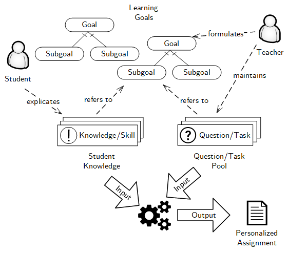
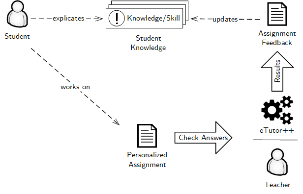
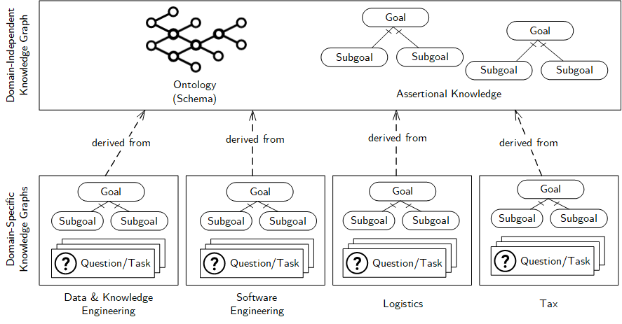

The accommodation of large numbers of students is often at odds with offering interactive, personalized learning experiences tailored to the needs of the students. The proposed eTutor++ system aims to overcome the dichotomy between mass teaching and personalized learning by providing students with assignments that automatically adapt to the student’s current learning needs, considering the individual student’s progress. Besides offering personalized assignments that aid students achieve the learning goals, the eTutor++ system will also allow teachers to issue assignments for the purposes of student assessment (or grading).

Personalization of Assignments
----

The eTutor++ system will employ machine-readable representations of course learning goals and student knowledge in order to provide personalized assignments. 

For a particular course, the teacher formulates learning goals as well as a timeline for goal achievement, alternative learning paths, and dependencies between goals – a knowledge graph for learning goals. For example, for a course in production and logistics management, one goal may be “Knowing the basics of linear optimization” and another goal “Applying linear optimization to logistics planning”. For a course on data modeling, a teacher may specify the learning goal “Writing SQL queries”, which is further divided into the subgoals “Writing basic SELECT statements”, “Performing aggregation using GROUP BY”, etc., each of which is again divided into subgoals; the students should first know to write basic SELECT statements before performing aggregation. A student participating in a course explicates their preexisting knowledge, either through self-assessment or placement quizzes. For example, students with a background from a technical school (HTL) may state that they already know about basic SQL queries or students may state that they already know about linear optimization. In the master program on business informatics, students with a business administration degree may require additional exercises for programming. For each course, there also exists a pool of questions and tasks mapped to the learning goals. To aid their progress, students receive personalized assignments, compiled from the available pool of questions and tasks, which take into account the student’s current knowledge and help the student achieve the learning goals at each stage of a course, in accordance with an ideal learning path specified by the teacher.

Adapting to Individual Learning Curves
----

The eTutor++ system will adapt to a student’s individual learning curve by updating student knowledge based on the submitted solutions. 

Students submit solutions for the personalized assignments to the eTutor++ system for evaluation, which may be done either automatically via the eTutor++ system or through a human teacher. The eTutor++ system takes into account the assignment feedback when compiling future assignment sheets by including questions related to learning goals that the student failed to achieve in earlier stages of the course.

Powered by Knowledge Graphs
----
Knowledge graphs will drive the personalization of student's learning experiences. A knowledge graph represents real-world entities and their relationships. Knowledge graphs are the backbone of intelligent applications, supporting a wide variety of applications, from web search to air traffic management, social network analysis to electronic commerce.

In eTutor++, a domain-independent knowledge graph formalizes general knowledge used to facilitate personalization. Domain- and course-dependent knowledge graphs define topics, learning goals, questions, etc.

The eTutor++ system will facilitate the reuse of knowledge graphs and question pools across semesters and courses. Even courses from different programs will be able to draw from the shared pool of questions. For example, SQL is relevant for courses in business informatics as well as business and economics. The depth of coverage, however, is different in both programs. By attaching questions and tasks with learning goals and specifying learning goals for the different courses, a business and economics course that teaches students the basics of SQL will also be able to use the shared question pool and automatically assign students preparatory questions, tailored to the respective course’s requirements.

Automated Feedback
----
The eTutor++ comes with modules for automated feedback on submissions for exercises on selected topics. For example, students may compose and submit solutions to exercises on SQL, a query language for relational databases, in an online editor with syntax highlighting, receiving feedback regarding the correctness of their submitted solutions.

